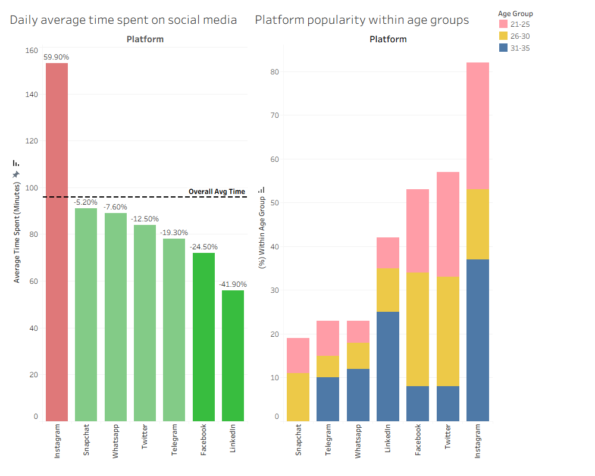

# Social Media Usage Analysis

## Objective
Analyse daily social media usage across seven platforms to identify over- and under-utilised platforms, and examine platform popularity across age groups to understand usage preferences by age range.

## Dataset
Social Media Usage and Emotional Well-Being dataset sourced from Kaggle.
**Note:** The original dataset contains approximately 1,000 records. After import and data quality checks, 924 records were retained for analysis due to missing or invalid entries.

## Methodology
- Calculated average daily time spent (minutes) per social media platform
- Calculated overall average daily time spent (minutes) of the whole dataset
- Calculated the % difference of the average daily time spent per platform compared to the overall average daily time spent
- Binned users into 3 age groups (21-25, 26-30, 31-35)
- Calculated % of each platform out of all platforms used by each age group
- Visualised results using bar chart and stack bar chart in Tableau

## Key Findings
- Instagram has the highest average daily time spent across the 7 platforms
- Instagram has the highest popularity among 2 of the 3 age groups
- Average daily usage for LinkedIn increases as age increases

## Files
- `soc_med_dailyuse_age_group.sql` – SQL query used for analysis
- `socmed_barcharts_usageagegroups.png` – Visualisation of results

## Output

